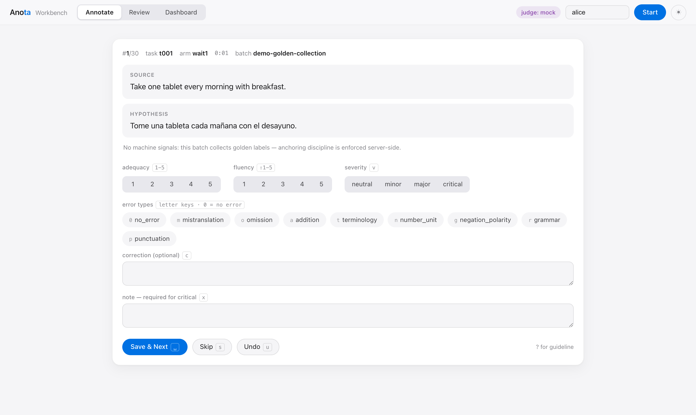
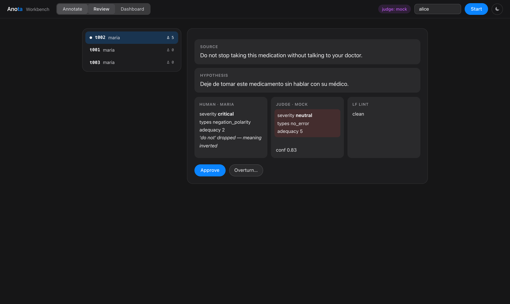
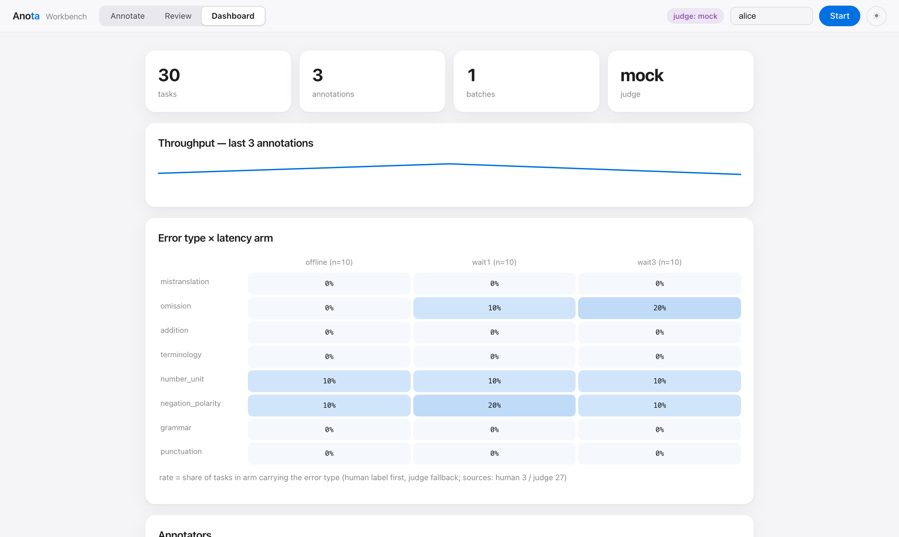

# Anota Workbench

**A self-hosted, keyboard-first annotation workbench for translation & interpretation
quality assessment — with the quality-operations layer built into the data model.**

FastAPI + SQLite + vanilla JS. One process, three runtime dependencies, no ORM, no build
chain. Boots in seconds on a laptop; the same artifact deploys inside a compliance boundary.

> **Why it is built this way, how it compares to Label Studio / Argilla / Prodigy / Scale,
> deployment economics, and the roadmap: [docs/DESIGN.md](docs/DESIGN.md).**

All bundled demo data is synthetic (EN→ES medication instructions written for this project).
No PHI anywhere. Demo-grade by design — scale limits are documented, not hidden (§Limitations).

| Annotate (light) | Review & adjudication (dark) |
|---|---|
|  |  |



---

## Table of contents

1. [Core ideas](#core-ideas)
2. [Quick start](#quick-start)
3. [Docker](#docker)
4. [The annotation loop, end to end](#the-annotation-loop-end-to-end)
5. [Keyboard reference](#keyboard-reference)
6. [Concepts & data model](#concepts--data-model)
7. [Annotation schema & validation rules](#annotation-schema--validation-rules)
8. [Importing your own data](#importing-your-own-data)
9. [Configuration](#configuration)
10. [HTTP API](#http-api)
11. [Exports](#exports)
12. [Project layout](#project-layout)
13. [Development guide](#development-guide)
14. [Limitations](#limitations)
15. [Roadmap](#roadmap)

---

## Core ideas

Anota's thesis: *annotation interfaces are a commodity; annotation **operations** are not.*
Five disciplines are enforced as system behavior rather than team convention:

1. **Anchoring policy is server-side.** Whether annotators see machine hints is a property
   of the *batch* (`show_suggestions`), enforced at the API boundary: a golden-collection
   batch's claim response **does not contain** judge/lint fields at all — they are stripped
   from the wire, not hidden by CSS. Routing batches carry them explicitly.
2. **Golden sets are blind by schema.** Honeypot answers live in a server-only table; no
   annotator-facing payload ever includes `is_golden` or the answer.
3. **Labels are append-only.** Corrections and undo create new rows (latest-wins per
   annotator); reviewer overrides layer on top; every state transition is audited.
4. **The LLM judge is a first-pass filter, never the final arbiter.** Its verdicts route work
   and rank review queues; humans adjudicate. If the judge endpoint is down, annotation is
   untouched. A deterministic MockJudge keeps demos and CI runs reproducible offline.
5. **Exports are citable.** Snapshots are canonical-JSON, content-hashed (sha256), and
   versioned (`dataset@vN`) — identical data always hashes identically.

## Quick start

Requires Python ≥ 3.10.

```bash
python3 -m venv .venv && .venv/bin/pip install -r requirements.txt
.venv/bin/python run.py --demo        # → http://localhost:8420
```

`--demo` boots a throwaway DB with 30 synthetic EN→ES tasks (12 planted errors across three
latency arms), a 6-item golden set, a second annotator's seed labels, and pre-computed
mock-judge verdicts — so every screen has data on first open.

For a persistent database instead: `.venv/bin/python run.py --db anota.db`

## Docker

```bash
docker build -t anota .
docker run -p 8420:8420 -v anota-data:/data anota     # persistent DB in the named volume
docker run -p 8420:8420 anota --demo                  # throwaway demo instance
```

One container, no sidecar services — that absence is deliberate (see
[docs/DESIGN.md §5](docs/DESIGN.md)). Any args after the image name are passed to `run.py`.

## The annotation loop, end to end

The 5-minute path through the whole closed loop:

1. **Annotate** — enter an annotator id, press **Start**. A clean record is two keystrokes
   (`0` then `Space`; adequacy/fluency auto-default to 5 and stay overridable). An error
   record: `g` (negation) → `v` until *critical* → `2` adequacy → `⇧4` fluency → `x`, type
   the evidence note, `Esc`, `Space`. Note the screen shows **no machine hints** — this
   batch collects golden labels (idea #1 above).
2. **Dashboard** — the *error type × latency arm* matrix shows what the low-latency arm
   costs in omission/negation errors; annotator table tracks golden accuracy and pace;
   κ panels track inter-annotator and judge–human agreement.
3. **Route** — *Build routing batch* from lowest judge confidence, then click **annotate**
   on the new batch row: claims now carry judge + lint suggestion chips (labeled MOCK when
   the mock judge produced them).
4. **Review** — the queue ranks human/judge/lint disagreement first. Open an item to see the
   three-way comparison; **Approve** or **Overturn** with a case note — case notes are the
   raw material for the next guideline version.
5. **Export** — a content-hashed, versioned snapshot lands in `exports/`.

## Keyboard reference

Active on the Annotate tab (except in text fields; `Esc` leaves a text field).

| Key | Action |
|---|---|
| `1–5` | adequacy rating |
| `⇧1–5` | fluency rating |
| `v` | cycle severity (neutral → minor → major → critical) |
| `m o a t n g r p` | toggle error type (mistranslation, omission, addition, terminology, number_unit, negation_polarity, grammar, punctuation) |
| `0` | no_error (exclusive; auto-sets severity neutral, ratings 5) |
| `Space` | save & claim next |
| `u` | undo last submit (reopens it; the previous row is kept — append-only) |
| `s` | skip |
| `c` / `x` | focus correction / note field |
| `?` | guideline modal |
| `Esc` | leave text field / close modal |

## Concepts & data model

Nine SQLite tables; the ones that carry the design:

| Table | Role | Design notes |
|---|---|---|
| `batches` | unit of policy | `show_suggestions` (anchoring policy), `overlap` (how many annotators per task), `guideline_version`, `lang_profile` |
| `tasks` | source/hypothesis/reference + metadata | lint results embedded as `lf_flags`; `metadata.arm` powers the latency matrix |
| `golden_answers` | honeypot truth | **server-only**; never serialized to annotator paths |
| `assignments` | the mutable state machine | claim → 30-min lease → submitted/skipped; expired leases are reaped (audited) and the task returns to the pool |
| `annotations` | labels | **append-only**; latest row per (task, annotator) wins |
| `reviews` | adjudication | approve / overturn (+ replacement annotation row by `reviewer:<id>`) |
| `judge_results` | LLM verdicts | verdict JSON + confidence + `is_mock` flag |
| `audit_log` | everything | append-only record of claim/submit/skip/undo/reap/review/import/export |
| `exports` | snapshot registry | version, filters, sha256, path |

**Distribution semantics:** an annotator never receives the same task twice after
submitting or skipping it; a task is claimable while fewer than `overlap` other annotators
hold or have submitted it. All multi-step writes run under one lock.

**Final label resolution** (used by exports, the matrix, and agreement stats): reviewer
overturn wins; else a single annotator's latest row; else a strict-majority aggregate
(per-label majority, median ratings rounded half-up, severity mode with ties going to the
stricter category). Aggregates with no majority are flagged `unresolved` and quarantined
from κ and matrix statistics rather than silently coerced.

## Annotation schema & validation rules

- **Error types (9):** `no_error, mistranslation, omission, addition, terminology,
  number_unit, negation_polarity, grammar, punctuation` — an MQM-derived set with the three
  medical-critical categories (dosage numbers, negation, terminology) promoted to
  first-class labels.
- **Severity:** `neutral / minor / major / critical` (weights 0/1/5/25, per MQM convention).
- **Ratings:** adequacy and fluency, 1–5.
- **Rules enforced server-side** (and mirrored client-side so annotators never round-trip
  to learn them): `no_error` is exclusive and forces severity neutral; a real error can
  never be severity neutral; `critical` requires a non-empty evidence note.
- The guideline (`data/guideline.md`) renders in the `?` modal **and** is injected into the
  judge's system prompt — one rubric, single source of truth for humans and models.

### Built-in lint (labeling functions)

Four deterministic checks run once at import, per language profile (`en-es`, `zh-en`),
attached to tasks as evidence-carrying flags — shown to reviewers and routing, hidden from
clean-batch annotators:

| LF | Catches | Notes |
|---|---|---|
| `lf_negation_drop` | source negation with no target counterpart | handles English contractions (`don't`) |
| `lf_number_mismatch` | dropped/changed numbers | language-scoped numeral lexicons: zh compound numerals (二十→20), es `once`=11, en `twice`=2 |
| `lf_untranslated_fragment` | copied-through source spans / CJK residue | |
| `lf_length_ratio` | truncation / over-generation | per-language bounds; abstains on short sources |

## Importing your own data

```bash
.venv/bin/python run.py --import-file corpus.jsonl --profile generic --lang en-es \
  --batch pilot-1 --golden golden.jsonl --overlap 2
```

**Generic profile** — one JSON object per line:

```json
{"id": "t001", "source": "…", "translation": "…", "reference": "…",
 "metadata": {"arm": "wait3", "al_ms": 1810}}
```

(`translation` may be named `hypothesis`; `reference` and `metadata` are optional. `arm`
metadata is what populates the latency-arm matrix.)

**Golden file** — server-side only, per line:

```json
{"task_id": "t001", "answer": {"error_types": ["no_error"], "worst_severity": "neutral", "adequacy": 5}}
```

**`aqb` profile** maps `source_zh` / `hypothesis_en` / `reference_en` plus top-level
`arm`/`AL_ms` fields (see `app/importer.py:PROFILES` to add your own mapping).

Re-running an import is safe: tasks whose `id` already exists are skipped and counted, not
duplicated. `--suggestions` marks the imported batch as a routing batch (hints visible).

## Configuration

**CLI (`run.py`):**

| Flag | Default | Meaning |
|---|---|---|
| `--demo` | off | fresh temp DB + synthetic data |
| `--db PATH` | `anota.db` | SQLite file |
| `--port` / `--host` | `8420` / `127.0.0.1` | bind address (`0.0.0.0` in containers) |
| `--import-file / --profile / --lang / --batch / --golden / --suggestions / --overlap` | — | see [Importing](#importing-your-own-data) |

**Environment (LLM judge):**

| Variable | Default | Meaning |
|---|---|---|
| `ANOTA_JUDGE` | `mock` | `mock` (deterministic, offline) or `openai` |
| `ANOTA_JUDGE_BASE_URL` | `http://localhost:8000/v1` | any OpenAI-compatible endpoint (vLLM, llama.cpp, commercial) |
| `ANOTA_JUDGE_MODEL` | auto-detect | first model served if unset |
| `ANOTA_JUDGE_API_KEY` | `EMPTY` | bearer token if the endpoint needs one |

```bash
ANOTA_JUDGE=openai ANOTA_JUDGE_BASE_URL=http://localhost:8000/v1 .venv/bin/python run.py --demo
```

Judge failure never breaks annotation: the top-bar badge degrades and humans keep working.

## HTTP API

All JSON under `/api`. The frontend is just a client of this API — automation can drive it
the same way.

| Endpoint | Method | Purpose |
|---|---|---|
| `/claim` | POST | `{annotator, batch_id?}` → next task + progress; suggestion fields present **only** for routing batches |
| `/submit` | POST | annotation payload; `422` invalid, `404` foreign assignment, `409` not open |
| `/skip`, `/undo` | POST | skip with reason; reopen last submitted |
| `/batches` | GET | batches incl. `n_tasks`, policy, overlap |
| `/review/queue` | GET | unreviewed latest annotations, disagreement-ranked, with judge + lint context |
| `/review/{annotation_id}` | POST | `{verdict: approved\|overturned, case_note, replacement?}` |
| `/stats/overview` · `/stats/matrix` · `/stats/annotators` · `/stats/agreement` | GET | dashboard aggregates (κ, golden accuracy, error×arm matrix with `sources` disclosure) |
| `/judge/run` | POST | `{batch_id}` → judge every task in the batch (`503` if unreachable) |
| `/routing/build` | POST | `{top_n, signal: judge_confidence\|lf_conflict}` → new routing batch |
| `/export` | POST | `{batch_id?, include_golden?}` → versioned snapshot |
| `/guideline`, `/health` | GET | rubric text; server + judge status |

## Exports

`POST /api/export` writes `exports/dataset_vN.json`:

- **content**: tasks (source/hypothesis/reference/metadata), resolved final labels
  (with `unresolved` flags), every raw annotation row (append-only history included),
  annotator list, guideline version, filters;
- **integrity**: `sha256` over the canonical JSON of the content — export the same data
  twice and the hash is identical, so downstream work cites `dataset@vN` + hash;
- golden answers are included **only** when `include_golden: true` is requested.

`app/export.py` also provides `export_golden_jsonl()` for round-tripping golden sets.

## Project layout

```
run.py               entry point: server, demo seeding, CLI import
app/
  main.py            API layer; batch policy enforced here (response shaping)
  db.py              SQLite + DDL (9 tables) + audit helper; one lock, no ORM
  models.py          schema constants + payload validation (the annotation rules)
  tasks.py           claim/lease/submit/skip/undo state machine
  lf.py              4 labeling functions × 2 language profiles
  judge.py           MockJudge (deterministic) + OpenAI-compatible client
  quality.py         Cohen's κ (plain/weighted, textbook-pinned), golden scoring,
                     final-label resolution, error×arm matrix
  importer.py        import profiles, golden loading, demo seeding
  export.py          canonical-JSON snapshots + sha256 + golden JSONL
static/              no-build frontend: index.html + app.js (annotate) +
                     review.js + dash.js + style.css (Apple-style, light/dark)
data/                synthetic demo corpus, golden set, seed labels, guideline.md
tests/               74 tests: state machine, LFs, κ math, policy-leak checks,
                     export determinism, full API flows
docs/                DESIGN.md (rationale & industry analysis), screenshots,
                     make_screenshots.js, plans/ (development history)
```

## Development guide

```bash
.venv/bin/python -m pytest -q        # 74 tests, sub-second
```

**Add an error type**: extend `ERROR_TYPES` in `app/models.py`, add a letter key in
`static/app.js` (`ERRORS`), and describe it in `data/guideline.md`. Severity/validation
rules apply automatically.

**Add a labeling function**: write it in `app/lf.py` returning
`(ERROR|OK|ABSTAIN, evidence)`, register it in `run_lfs`, map it in `LF_TO_ERROR`, add
positive/negative/abstain fixtures in `tests/test_lf.py`. Prefer ABSTAIN over guessing.

**Add an import profile**: one dict in `app/importer.py:PROFILES`.

**Swap the judge**: implement `.evaluate(task, lf_results) -> dict` with the verdict keys
(see `app/judge.py`) — anything from a rules engine to a hosted model.

**Regenerate README screenshots** (needs Chrome + a running `--demo` server):

```bash
npm i puppeteer-core && node docs/make_screenshots.js
```

Conventions: server-side validation is the source of truth (client mirrors it for UX);
annotations/audit are never UPDATEd; anything annotator-facing must respect batch policy —
there is a test that fails if a clean-batch claim response ever contains suggestion fields.

## Limitations

Stated, not hidden:

- SQLite + a single process lock: comfortable to ~10 concurrent annotators and
  low-hundreds-of-thousands of records; some dashboard queries are N+1 (fine at this scale).
- Identity is self-reported (`annotator id` box); put SSO in front of it via a reverse
  proxy for anything real. Reviewer identity is a fixed `lead` pending RBAC.
- Text-only today (audio rendition playback is the top roadmap item).
- 5-second dashboard polling, not SSE.
- US-QWERTY assumption for `⇧1–5` fluency keys.

## Roadmap

Near term: reverse-proxy SSO identity · pipx packaging · HF `datasets` export · ESA-style
span marking · guideline-version drafting from case notes. Mid term: **audio rendition
playback** · honeypot rotation & calibration batches · IAA drill-down · continuous
uncertainty routing · xCOMET as a second automated signal. Long term: Postgres + SSE ·
multi-project workspaces · LF plugin registry.

Full reasoning behind each item: [docs/DESIGN.md §6](docs/DESIGN.md).
