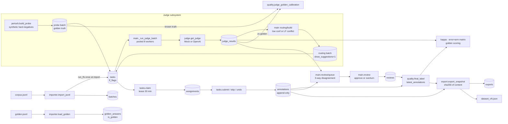
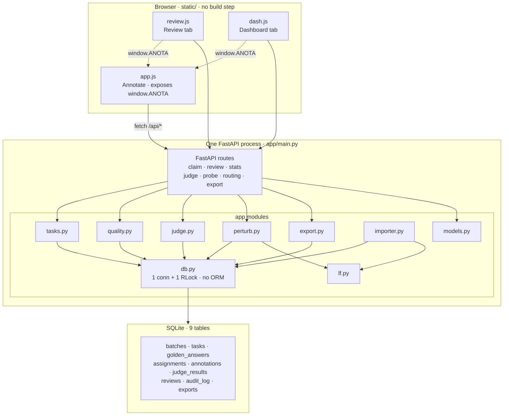
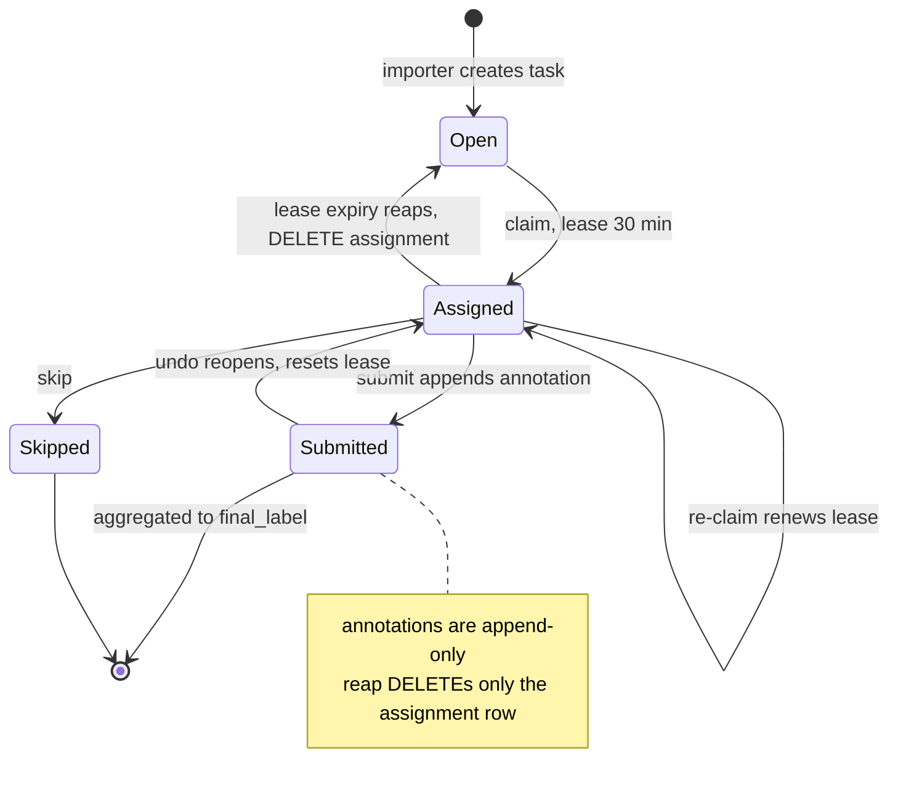
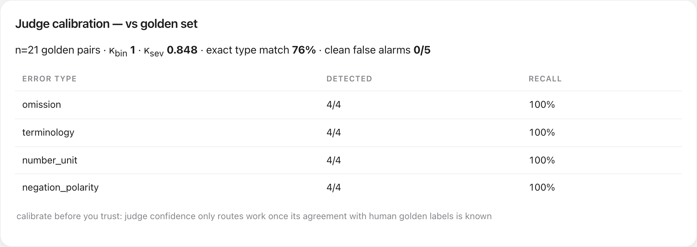

<div align="center">

# Anota&nbsp;Workbench

**Annotation *interfaces* are a commodity. Annotation *operations* are not.**

Anota is a keyboard-first, self-hosted workbench for **translation & interpretation quality
assessment** that bakes the hard part — blind golden sets, append-only audit trails, an LLM
judge you must *calibrate before you trust*, and content-hashed citable exports — straight
into the data model.

**One Python process · three dependencies · no build step · boots in seconds.**

<br>


[](LICENSE)

</div>

---

## Highlights

- **🕵️ Blind by construction.** For golden-collection batches, judge/lint hints are *stripped
  from the JSON on the wire* — not hidden with CSS. A test fails if a clean claim response ever
  leaks a suggestion field. Anchoring bias can't sneak in through DevTools.
- **⚖️ A judge you calibrate before you trust.** Synthetic perturbations with *known* truth
  score the LLM judge's per-type recall and false-alarm rate against golden — zero human
  labeling. Field-tested at **κ_bin 1.0 · κ_sev 0.85 · 4/4 recall · 0/5 false alarms** on a
  self-hosted Qwen3-14B.
- **🔌 Provider-agnostic judge.** GPT, Gemini, or a self-hosted vLLM/Ollama — the judge speaks
  the OpenAI Chat Completions protocol, so you swap models with **two env vars**; self-host and
  the content never leaves your boundary.
- **🧾 Append-only, fully audited.** Corrections and undo create *new* rows (latest-wins);
  every claim / submit / undo / lease-reap / review is an audit entry. No destructive write
  path exists — anywhere.
- **📐 Agreement math from scratch.** Hand-written Cohen's κ (plain + linear-weighted) pinned
  to textbook values in tests (0.4 on the 2×2, −1.0 on an adjacent-category swap). No sklearn.
- **📊 A domain analytic nobody else ships.** An *error-type × latency-arm* matrix that answers
  the real question for simultaneous translation: *what does low latency cost you in dropped
  negations and numbers?*
- **⚡ Runs anywhere, instantly.** Two commands, port 8420, same artifact deploys inside a
  compliance boundary. **83 tests, sub-second.**

<div align="center">

### Dashboard — quality operations at a glance


</div>

<details>
<summary><b>Table of contents</b></summary>

1. [Quick start](#quick-start) · [Docker](#docker)
2. [Architecture at a glance](#architecture-at-a-glance)
3. [Core ideas](#core-ideas)
4. [The annotation loop, end to end](#the-annotation-loop-end-to-end)
5. [Keyboard reference](#keyboard-reference)
6. [Concepts & data model](#concepts--data-model)
7. [Annotation schema & validation](#annotation-schema--validation)
8. [The judge, calibrated](#the-judge-calibrated)
9. [Screens](#screens)
10. Reference (collapsed): [Importing](#importing-your-own-data) · [Configuration](#configuration) · [HTTP API](#http-api) · [Exports](#exports) · [Project layout](#project-layout) · [Development](#development)
11. [Limitations](#limitations) · [Roadmap](#roadmap)

</details>

---

## Quick start

Requires Python ≥ 3.10.

```bash
python3 -m venv .venv && .venv/bin/pip install -r requirements.txt
.venv/bin/python run.py --demo        # → http://localhost:8420
```

`--demo` boots a throwaway DB with **30 synthetic EN→ES tasks** (12 planted errors across
three latency arms), a **6-item golden set**, a second annotator's seed labels, and
pre-computed mock-judge verdicts — so every screen has data on first open.

Persistent DB instead: `.venv/bin/python run.py --db anota.db`

> All bundled demo data is synthetic (EN→ES medication instructions written for this project).
> **No PHI anywhere** — demo-grade by design; scale limits are documented, not hidden
> ([§Limitations](#limitations)).

### Docker

```bash
docker build -t anota .
docker run -p 8420:8420 -v anota-data:/data anota     # persistent DB in a named volume
docker run -p 8420:8420 anota --demo                  # throwaway demo instance
```

One container, no sidecar services — that absence is deliberate
([docs/DESIGN.md §5](docs/DESIGN.md)). Any args after the image name are passed to `run.py`.

---

## Architecture at a glance

One FastAPI process over stdlib `sqlite3` (one connection, one lock, no ORM — [on
purpose](docs/DESIGN.md)). Lint runs once at import; the judge subsystem feeds routing and
calibration but never blocks human annotation.



<details>
<summary>Module &amp; table map (one process, 9 tables, 3 no-build JS files)</summary>



</details>

---

## Core ideas

Anota's thesis: *annotation interfaces are a commodity; annotation **operations** are not.*
Five disciplines are enforced as **system behavior**, not team convention:

| # | Discipline | What makes it real |
|---|---|---|
| 1 | **Anchoring policy is server-side** | `show_suggestions` is a column on `batches`; a clean batch's claim response *does not contain* judge/lint fields at all — stripped from the wire, not hidden by CSS. |
| 2 | **Golden sets are blind by schema** | Honeypot answers live in a server-only table; no annotator-facing payload ever includes `is_golden` or the answer. |
| 3 | **Labels are append-only** | Corrections and undo create new rows (latest-wins); reviewer overrides layer on top; every transition is audited. |
| 4 | **The judge is a first-pass filter** | Verdicts route work and rank review queues; humans adjudicate. If the judge is down, annotation is untouched. A deterministic `MockJudge` keeps demos/CI reproducible offline. |
| 5 | **Exports are citable** | Snapshots are canonical-JSON, content-hashed (sha256), versioned (`dataset@vN`) — identical data always hashes identically. |

Full reasoning for each decision: **[docs/DESIGN.md](docs/DESIGN.md)** (also covers how Anota
compares to Label Studio / Argilla / Prodigy / Scale, deployment economics, and the roadmap).

---

## The annotation loop, end to end

The 5-minute path through the whole closed loop:

| # | Step | What happens |
|---|---|---|
| 1 | **Annotate** | Enter an id, press **Start**. A clean record is two keystrokes (`0` then `Space`). This batch shows **no machine hints** — it collects golden labels (idea #1). |
| 2 | **Dashboard** | The error-type × latency-arm matrix shows what the low-latency arm costs; annotator table tracks golden accuracy + pace; κ panels track inter-annotator and judge–human agreement. |
| 3 | **Probe & calibrate** | *Build judge probe* → synthetic errors with known truth; *run judge* (pooled, live progress); the calibration card fills in per-type recall and false-alarm rates. |
| 4 | **Route** | *Build routing batch* from lowest judge confidence, then **annotate** it — claims now carry judge + lint chips (labeled `MOCK` when the mock judge produced them). |
| 5 | **Review** | The queue ranks human/judge/lint disagreement first. Open an item for the three-way comparison; **Approve** or **Overturn** with a case note — the raw material for the next guideline version. |
| 6 | **Export** | A content-hashed, versioned snapshot lands in `exports/`. |

---

## Keyboard reference

Active on the Annotate tab (except in text fields; `Esc` leaves a text field).

| Key | Action | Key | Action |
|---|---|---|---|
| `1–5` | adequacy rating | `Space` | save & claim next |
| `⇧1–5` | fluency rating | `u` | undo last submit (prior row kept — append-only) |
| `v` | cycle severity (neutral → minor → major → critical) | `s` | skip |
| `0` | no_error (exclusive; sets neutral + ratings 5) | `c` / `x` | focus correction / note field |
| `m o a t n g r p` | toggle error type | `?` / `Esc` | guideline modal / leave field |

`m o a t n g r p` = mistranslation, omission, addition, terminology, number_unit,
negation_polarity, grammar, punctuation.

---

## Concepts & data model

Nine SQLite tables; the ones that carry the design:

| Table | Role | Design notes |
|---|---|---|
| `batches` | unit of policy | `show_suggestions` (anchoring policy), `overlap` (annotators per task), `guideline_version`, `lang_profile` |
| `tasks` | source / hypothesis / reference + metadata | lint results embedded as `lf_flags`; `metadata.arm` powers the latency matrix |
| `golden_answers` | honeypot truth | **server-only**; never serialized to annotator paths |
| `assignments` | the mutable state machine | claim → 30-min lease → submitted/skipped; expired leases are reaped (audited) and the task returns to the pool |
| `annotations` | labels | **append-only**; latest row per (task, annotator) wins |
| `reviews` | adjudication | approve / overturn (+ replacement annotation row by `reviewer:<id>`) |
| `judge_results` | LLM verdicts | verdict JSON + confidence + `is_mock` flag |
| `audit_log` | everything | append-only record of claim/submit/skip/undo/reap/review/import/export |
| `exports` | snapshot registry | version, filters, sha256, path |

The task lifecycle — the correctness-critical part of the backend, all under one lock:



**Distribution semantics:** an annotator never receives the same task twice after submitting or
skipping it; a task is claimable while fewer than `overlap` other annotators hold or have
submitted it. **Final label resolution** (used by exports, the matrix, agreement stats):
reviewer overturn wins; else a single annotator's latest row; else a strict-majority aggregate.
Aggregates with no majority are flagged `unresolved` and **quarantined** from κ and matrix
statistics rather than silently coerced.

---

## Annotation schema & validation

- **Error types (9):** `no_error, mistranslation, omission, addition, terminology, number_unit,
  negation_polarity, grammar, punctuation` — an MQM-derived set, with the three medical-critical
  categories (dosage numbers, negation, terminology) promoted to first-class labels.
- **Severity:** `neutral / minor / major / critical` (weights 0/1/5/25, per MQM convention).
- **Ratings:** adequacy and fluency, 1–5.
- **Rules enforced server-side** (and mirrored client-side so annotators never round-trip to
  learn them): `no_error` is exclusive and forces severity neutral; a real error can never be
  severity neutral; `critical` requires a non-empty evidence note.
- The guideline (`data/guideline.md`) renders in the `?` modal **and** is injected into the
  judge's system prompt — one rubric, single source of truth for humans and models.

**Built-in lint (labeling functions)** — four deterministic checks run once at import, per
language profile (`en-es`, `zh-en`), attached to tasks as evidence-carrying flags; shown to
reviewers and routing, hidden from clean-batch annotators:

| LF | Catches | Notes |
|---|---|---|
| `lf_negation_drop` | source negation with no target counterpart | handles English contractions (`don't`) |
| `lf_number_mismatch` | dropped/changed numbers | language-scoped numeral lexicons: zh compound 二十→20, es `once`=11, en `twice`=2 |
| `lf_untranslated_fragment` | copied-through source spans / CJK residue | |
| `lf_length_ratio` | truncation / over-generation | per-language bounds; abstains on short sources |

---

## The judge, calibrated

The judge is treated as an **uncalibrated instrument until proven otherwise**. *Build judge
probe* creates a batch of **synthetic hard negatives with known truth** — clean demo
translations programmatically perturbed (negation injected, first number ×10, a domain term
swapped, a trailing clause dropped) plus unmodified controls. Because the injected error *is*
the ground truth, probe items feed the judge-vs-golden calibration card with **no human
labeling**: per-error-type recall, false-alarm rate on clean items, and κ against golden.

Field-tested against a self-hosted **Qwen3-14B** (vLLM, reasoning on): a 15-task probe judged
in **10 s** (pooled 8-wide; ~4 s/task sequential), and across demo golden + probe (n=21) it
scored **κ_bin 1.0, κ_sev 0.85, 4/4 recall on every error type, 0/5 clean false alarms** —
including terminology swaps invisible to lint.

<div align="center">



</div>

That contrast (lint-bound MockJudge vs semantic LLM judge) is the point of the card:
**calibrate before you trust** the judge's confidence for routing. Judge failure never breaks
annotation — the top-bar badge degrades and humans keep working. Runs are pooled (8 workers)
and can run in the background with live `done/total` progress.

---

## Screens

| Annotate (light) | Review & adjudication (dark) |
|---|---|
|  |  |

Keyboard-first annotation with the anchoring notice ("this batch collects golden labels"); and
the three-way Human · Judge · LF-Lint comparison that ranks disagreement first for the reviewer.
The UI follows system light/dark with an override cycle.

---

## Reference

<details>
<summary><b>Importing your own data</b></summary>

<br>

```bash
.venv/bin/python run.py --import-file corpus.jsonl --profile generic --lang en-es \
  --batch pilot-1 --golden golden.jsonl --overlap 2
```

**Generic profile** — one JSON object per line:

```json
{"id": "t001", "source": "…", "translation": "…", "reference": "…",
 "metadata": {"arm": "wait3", "al_ms": 1810}}
```

(`translation` may be named `hypothesis`; `reference` and `metadata` are optional. `arm`
metadata is what populates the latency-arm matrix.)

**Golden file** — server-side only, per line:

```json
{"task_id": "t001", "answer": {"error_types": ["no_error"], "worst_severity": "neutral", "adequacy": 5}}
```

**`aqb` profile** maps `source_zh` / `hypothesis_en` / `reference_en` plus top-level `arm`/`AL_ms`
fields (see `app/importer.py:PROFILES` to add your own mapping).

Re-running an import is safe: tasks whose `id` already exists are skipped and counted, not
duplicated. `--suggestions` marks the imported batch as a routing batch (hints visible).

</details>

<details>
<summary><b>Configuration</b> — CLI flags &amp; the LLM judge</summary>

<br>

**CLI (`run.py`):**

| Flag | Default | Meaning |
|---|---|---|
| `--demo` | off | fresh temp DB + synthetic data |
| `--db PATH` | `anota.db` | SQLite file |
| `--port` / `--host` | `8420` / `127.0.0.1` | bind address (`0.0.0.0` in containers) |
| `--import-file / --profile / --lang / --batch / --golden / --suggestions / --overlap` | — | see Importing |

**Environment (LLM judge):**

| Variable | Default | Meaning |
|---|---|---|
| `ANOTA_JUDGE` | `mock` | `mock` (deterministic, offline) or `openai` |
| `ANOTA_JUDGE_BASE_URL` | `http://localhost:8000/v1` | any OpenAI-compatible endpoint — self-hosted vLLM / llama.cpp / Ollama, OpenAI, Gemini (compat) |
| `ANOTA_JUDGE_MODEL` | auto-detect | first model served if unset (via `/models`); **set explicitly for hosted providers** |
| `ANOTA_JUDGE_API_KEY` | `EMPTY` | bearer token if the endpoint needs one |
| `ANOTA_JUDGE_SAMPLES` | `1` | self-consistency: sample k verdicts at temperature 0.7 and majority-aggregate; confidence becomes the severity-agreement fraction across samples |

**Judge providers.** The judge is provider-agnostic *by protocol* — it talks to any endpoint
that speaks the OpenAI Chat Completions API, so switching models is two env vars, no code change:

| Provider | `ANOTA_JUDGE_BASE_URL` | `ANOTA_JUDGE_MODEL` (example) |
|---|---|---|
| Self-hosted vLLM / llama.cpp / Ollama | `http://localhost:8000/v1` | auto-detect (single model) |
| **OpenAI GPT** | `https://api.openai.com/v1` | `gpt-4o` |
| **Google Gemini** | `https://generativelanguage.googleapis.com/v1beta/openai` | `gemini-2.0-flash` |

```bash
# Self-hosted (default) — content never leaves your machine
ANOTA_JUDGE=openai ANOTA_JUDGE_BASE_URL=http://localhost:8000/v1 .venv/bin/python run.py --demo

# OpenAI GPT
ANOTA_JUDGE=openai ANOTA_JUDGE_BASE_URL=https://api.openai.com/v1 \
  ANOTA_JUDGE_API_KEY=sk-... ANOTA_JUDGE_MODEL=gpt-4o .venv/bin/python run.py --demo

# Google Gemini (via its OpenAI-compatible endpoint)
ANOTA_JUDGE=openai ANOTA_JUDGE_BASE_URL=https://generativelanguage.googleapis.com/v1beta/openai \
  ANOTA_JUDGE_API_KEY=$GEMINI_API_KEY ANOTA_JUDGE_MODEL=gemini-2.0-flash .venv/bin/python run.py --demo
```

> **Any other provider** (native Gemini/Claude, Bedrock, Azure OpenAI, Together, Groq…): drop a
> [LiteLLM](https://github.com/BerriAI/litellm) proxy in front — it exposes a unified
> OpenAI-compatible `/v1` for 100+ models — and point `ANOTA_JUDGE_BASE_URL` at it. (Note: some
> reasoning models such as o1/o3 reject the `temperature` parameter.)

</details>

<details>
<summary><b>HTTP API</b> — all JSON under <code>/api</code>; the frontend is just a client</summary>

<br>

| Endpoint | Method | Purpose |
|---|---|---|
| `/claim` | POST | `{annotator, batch_id?}` → next task + progress; suggestion fields present **only** for routing batches |
| `/submit` | POST | annotation payload; `422` invalid, `404` foreign assignment, `409` not open |
| `/skip`, `/undo` | POST | skip with reason; reopen last submitted |
| `/batches` | GET | batches incl. `n_tasks`, policy, overlap |
| `/review/queue` | GET | unreviewed latest annotations, disagreement-ranked, with judge + lint context |
| `/review/{annotation_id}` | POST | `{verdict: approved\|overturned, case_note, replacement?}` |
| `/stats/overview` · `/stats/matrix` · `/stats/annotators` · `/stats/agreement` | GET | dashboard aggregates (pairwise κ, judge×human κ, judge-vs-golden calibration, golden accuracy, error×arm matrix with `sources` disclosure) |
| `/judge/run` | POST | `{batch_id, background?}` → judge every task, pooled 8-wide; sync returns `{n}`, background returns immediately (`503` unreachable, `409` already running) |
| `/judge/status` | GET | per-batch judge-run progress `{done, total, running, error}` |
| `/probe/build` | POST | `{source_batch_id?, per_type?}` → synthetic hard-negative batch with golden truth auto-registered |
| `/routing/build` | POST | `{top_n, signal: judge_confidence\|lf_conflict}` → new routing batch |
| `/export` | POST | `{batch_id?, include_golden?}` → versioned snapshot |
| `/guideline`, `/health` | GET | rubric text; server + judge status |

</details>

<details>
<summary><b>Exports</b> — content-hashed, versioned, citable</summary>

<br>

`POST /api/export` writes `exports/dataset_vN.json`:

- **content**: tasks (source/hypothesis/reference/metadata), resolved final labels (with
  `unresolved` flags), every raw annotation row (append-only history included), annotator list,
  guideline version, filters;
- **integrity**: `sha256` over the canonical JSON of the content — export the same data twice and
  the hash is identical, so downstream work cites `dataset@vN` + hash;
- golden answers are included **only** when `include_golden: true` is requested.

`app/export.py` also provides `export_golden_jsonl()` for round-tripping golden sets.

</details>

<details>
<summary><b>Project layout</b></summary>

<br>

```
run.py               entry point: server, demo seeding, CLI import
app/
  main.py            API layer; batch policy enforced here (response shaping)
  db.py              SQLite + DDL (9 tables) + audit helper; one lock, no ORM
  models.py          schema constants + payload validation (the annotation rules)
  tasks.py           claim/lease/submit/skip/undo state machine
  lf.py              4 labeling functions × 2 language profiles
  judge.py           MockJudge (deterministic) + OpenAI-compatible client
  quality.py         Cohen's κ (plain/weighted, textbook-pinned), golden scoring,
                     final-label resolution, error×arm matrix
  importer.py        import profiles, golden loading, demo seeding
  export.py          canonical-JSON snapshots + sha256 + golden JSONL
static/              no-build frontend: index.html + app.js (annotate) +
                     review.js + dash.js + style.css (Apple-style, light/dark)
data/                synthetic demo corpus, golden set, seed labels, guideline.md
tests/               83 tests: state machine, LFs, κ math, policy-leak checks,
                     export determinism, full API flows
docs/                DESIGN.md (rationale & industry analysis), screenshots,
                     make_screenshots.js, plans/ (development history)
```

</details>

<details>
<summary><b>Development</b></summary>

<br>

```bash
.venv/bin/python -m pytest -q        # 83 tests, sub-second
node --check static/app.js static/review.js static/dash.js   # no build step; syntax-check JS
```

**Add an error type**: extend `ERROR_TYPES` in `app/models.py`, add a letter key in
`static/app.js` (`ERRORS`), describe it in `data/guideline.md`. Rules apply automatically.

**Add a labeling function**: write it in `app/lf.py` returning `(ERROR|OK|ABSTAIN, evidence)`,
register in `run_lfs`, map in `LF_TO_ERROR`, add fixtures in `tests/test_lf.py`. Prefer ABSTAIN
over guessing.

**Add an import profile**: one dict in `app/importer.py:PROFILES`.

**Swap the judge**: implement `.evaluate(task, lf_results) -> dict` with the verdict keys (see
`app/judge.py`) — anything from a rules engine to a hosted model.

**Add a perturbation**: one function in `app/perturb.py` (`hyp -> perturbed | None`) registered
in `PERTURBATIONS` with its truth label — probe batches pick it up automatically.

**Regenerate screenshots** (needs Chrome + a running `--demo` server):

```bash
npm i puppeteer-core && node docs/make_screenshots.js
```

Conventions: server-side validation is the source of truth (client mirrors it for UX);
annotations/audit are never UPDATEd; anything annotator-facing must respect batch policy — a
test fails if a clean-batch claim response ever contains suggestion fields.

</details>

---

## Limitations

Stated, not hidden:

- **SQLite + a single process lock:** comfortable to ~10 concurrent annotators and
  low-hundreds-of-thousands of records; some dashboard queries are N+1 (fine at this scale).
- **Identity is self-reported** (`annotator id` box); put SSO in front of it via a reverse
  proxy for anything real. Reviewer identity is a fixed `lead` pending RBAC.
- **Text-only today** (audio rendition playback is the top roadmap item).
- 5-second dashboard polling, not SSE.
- US-QWERTY assumption for `⇧1–5` fluency keys.

## Roadmap

**Near term** — reverse-proxy SSO identity · `pipx` packaging · HF `datasets` export ·
ESA-style span marking · guideline-version drafting from case notes.

**Mid term** — **audio rendition playback** · honeypot rotation & calibration batches · IAA
drill-down · continuous uncertainty routing · xCOMET as a second automated signal.

**Long term** — Postgres + SSE · multi-project workspaces · LF plugin registry.

Full reasoning behind each item: [docs/DESIGN.md §6](docs/DESIGN.md).
